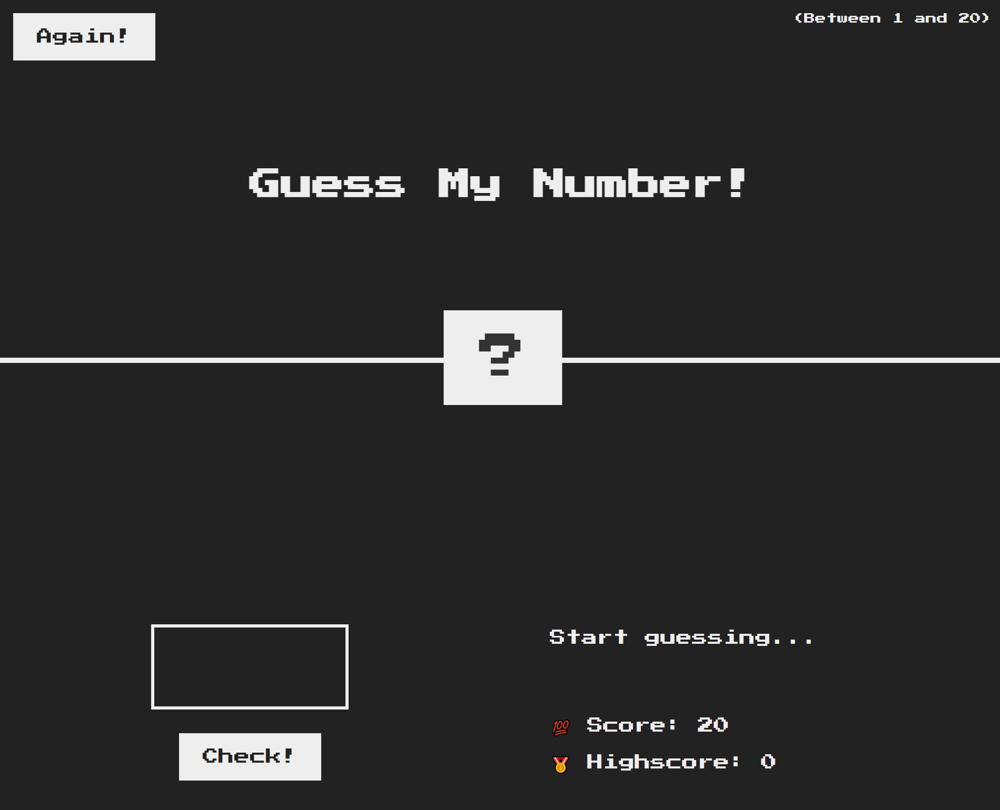
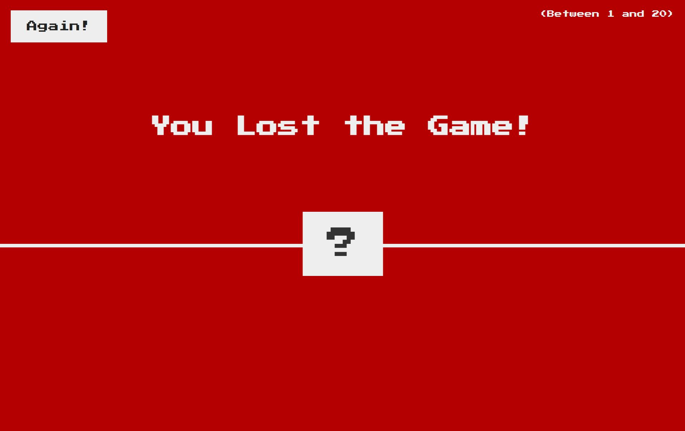
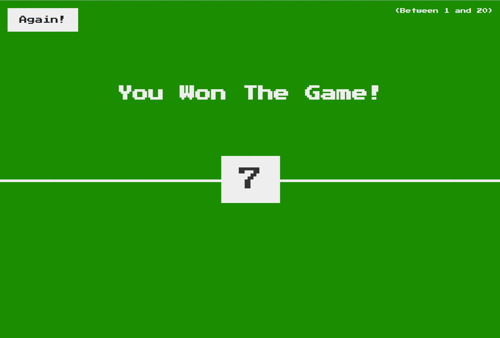

# Guess my number

This is a simple game I developed using HTML, CSS and JavaScript as part of my learning process.

I also would like to thank Github for the awesome oportunity to being able to publish my work so that other people may access and take a peek.

Please feel free to check it out using the following <a href="https://brenoingwersen.github.io/js-guess-my-number/">link</a>.

Below are some screen shots:

  

  

  

